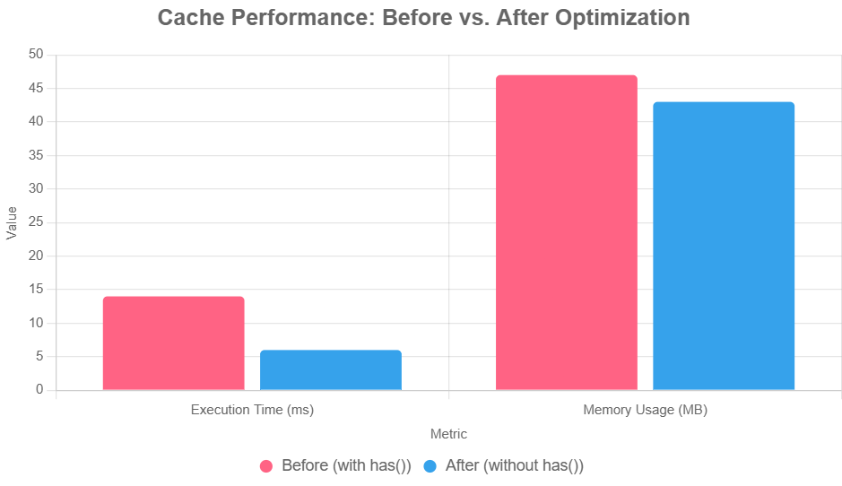

# Laravel Cache Tip: Avoid Redundant has/missing Calls

When working with Laravel's cache, I often see developers using a pattern that, while functional, creates unnecessary overhead. Let me show you a simple optimization that can improve both performance and memory usage.

## The Common Pattern (With Redundancy)

Here's a typical cache implementation I see frequently:

```php
public function getUserCount(): int
{
    $cacheKey = 'user-count';
    $cacheTtl = Carbon::now()->addMinutes(10);

    // Bad: two cache ops
    if (Cache::has($cacheKey)) {
        return (int) Cache::get($cacheKey);
    }

    $userCount = User::query()->count();
    Cache::put($cacheKey, $userCount, $cacheTtl);

    return $userCount;
}
```

This works perfectly, but there's a subtle inefficiency: **the cache is accessed twice** when the key exists.
Looking at Laravel Telescope, you'll see:

```
Action | Key
hit    | user-count  (line 31)
hit    | user-count  (line 32)
```

## The Better Approach: Skip `has()`

Instead of checking if the key exists first, we can directly attempt to retrieve it:

```php
public function getUserCountOptimized(): int
{
    $cacheKey = 'user-count';
    $cacheTtl = Carbon::now()->addMinutes(10);

    // Good: only one cache op
    $cachedValue = Cache::get($cacheKey);
    
    if ($cachedValue !== null) {
        return (int) $cachedValue;
    }

    $userCount = User::query()->count();
    Cache::put($cacheKey, $userCount, $cacheTtl);

    return $userCount;
}
```

Or just use Laravel's remember() method, which combines the check and retrieval into a single operation:

```php
public function getUserCountRemember(): int
{
    $cacheKey = 'user-count';
    $cacheTtl = Carbon::now()->addMinutes(10);

    return Cache::remember($cacheKey, $cacheTtl, function () {
        return User::query()->count();
    });
}
```

This results in only one cache hit, reducing overhead:

```
Action | Key
hit    | user-count  (line 31)
```

## When `remember()` Isn't Enough

So, yeah - `Cache::remember()` is fine if you're just dealing with basic stuff. However, `remember()` isn't always practical. For complex scenarios, like caching third-party API responses with conditional logic, `remember()` may not fit. Here's a real-world example from a third-party API integration that needed extra hoops:

```php
/**
 * Flow: from cache → try HTTP → handle response → cache it
 */
private function performRequest(string $endpoint, array $data = []): array
{
    $cacheKeyParams = ['endpoint' => $endpoint, ...$data];
    $cacheTags = [CacheKeyEnum::TM->tag()];

    if (isset($cacheKeyParams['code'])) {
        $cacheTags[] = CacheKeyEnum::SEARCH_ARTICLE->tag([$cacheKeyParams['code']]);
    }

    $cacheKey = CacheKeyEnum::TM->key($cacheKeyParams);
    $cacheTtl = TmApiEndpointEnum::getCacheTtl($endpoint);

    // Return the cached result first if caching is enabled
    if ($this->cacheEnabled) {
        if (Cache::tags($cacheTags)->has($cacheKey)) {
            $responseData = Cache::tags($cacheTags)->get($cacheKey);
            if ($responseData !== null) {
                return $responseData;
            }
        }
    }

    // Make API call
    try {
        $response = $this->getClient()->post($endpoint, $data)->throw();

        $responseData = $this->responseHandler($response);

        if (!empty($responseData)) {
            Cache::tags($cacheTags)->put($cacheKey, $responseData, $cacheTtl);
        }

        return $responseData;
    } catch (Throwable $exception) {
        return $this->handleException($exception, $endpoint, $data);
    }
}
```

This method handles monster-sized API responses (e.g., 1MB JSON) and logs two cache hits:

- **hit**: `tm|endpoint=pricesearch|...` (line 114)
- **hit**: `tm|endpoint=pricesearch|...` (line 115)

You can optimize it by removing the `has` check:

```php
if ($this->cacheEnabled) {
    $responseData = Cache::tags($cacheTags)->get($cacheKey);
    if ($responseData !== null) {
        return $responseData;
    }
}
```

## So, How Much Faster?

I actually ran the numbers. With huge api responses:

**Before (with `has()`):**
- About 14ms per execution
- 47MB memory
- 2 cache operations

**After (without `has()`):**
- Around 6ms
- 43MB
- Only 1 cache op



| Pattern      | Time | Memory | Cache Ops |
|--------------|------|--------|-----------|
| With `has()` | 14ms | 47MB   | 2         |
| Without      | 6ms  | 43MB   | 1         |

Both are snappy, but hey, that's almost double the speed and less memory. The optimized version shows measurable improvements in both execution time and memory usage.

## What's the Point?

**Avoid unnecessary `Cache::has()` or `Cache::missing()` calls** when you immediately follow them with `Cache::get()`. Each cache operation has overhead, and eliminating redundant calls improves performance, especially when dealing with large cached values.

The pattern is simple:

1. Try to get the value directly
2. Check if it's `null`
3. Proceed accordingly

It's a tiny change, but when multiplied across thousands of requests, the difference is real. One less cache call per request means faster responses and lower memory usage - for free.

Ever run into cache weirdness or found other sneaky optimizations in Laravel? Drop your stories below.